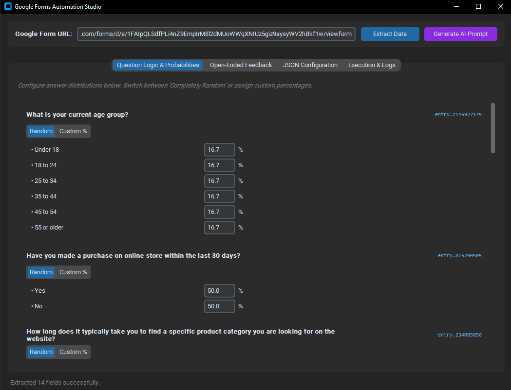
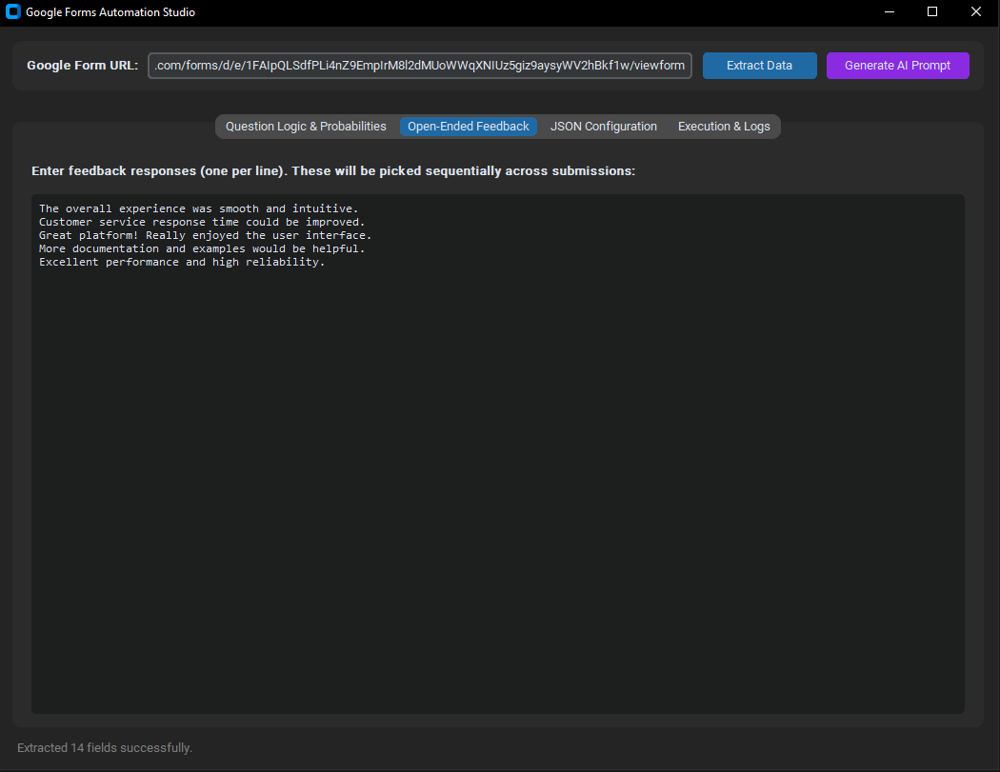
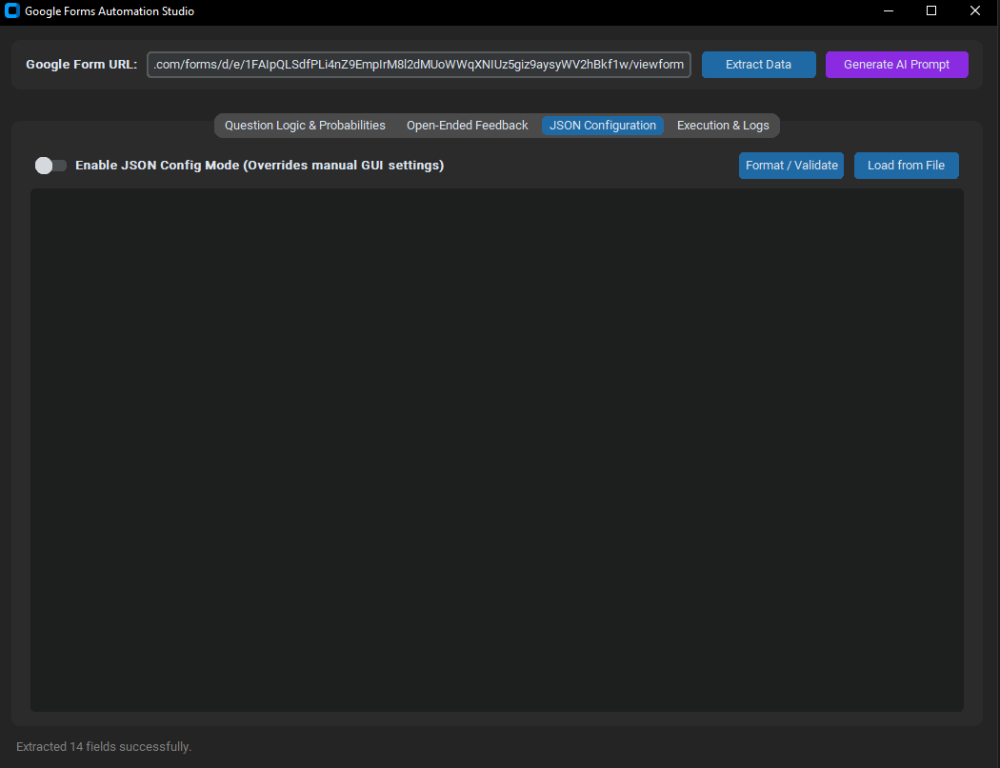
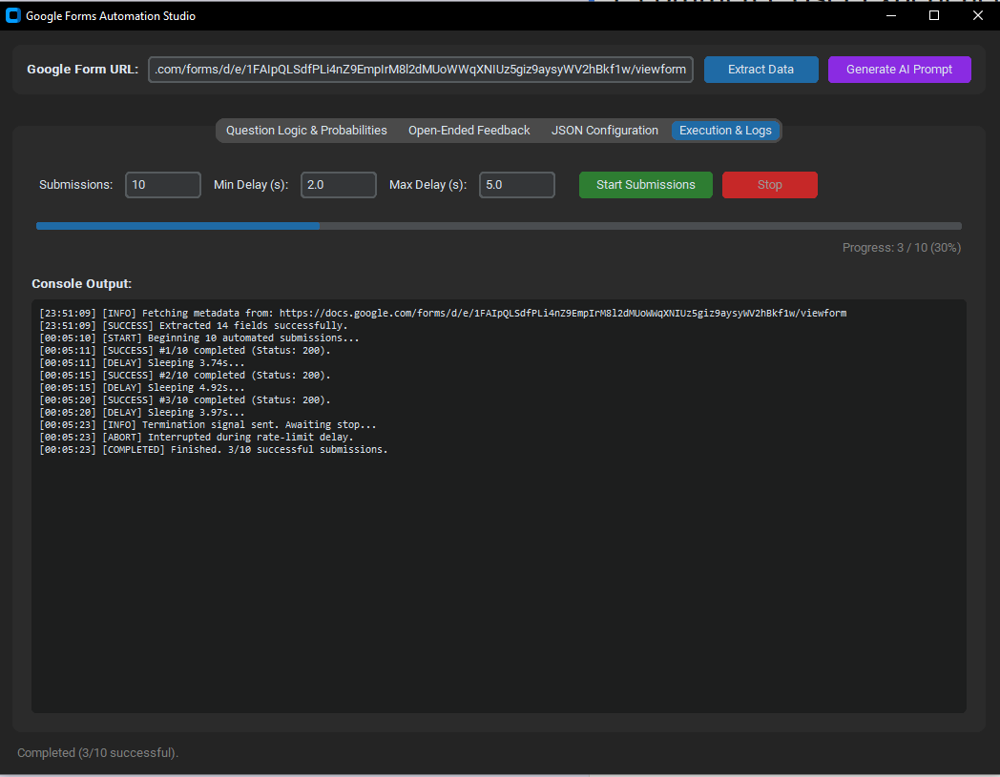

# 📝 Google Forms Automation Studio
### Desktop Edition

An automated desktop client designed for stress-testing, simulating, and automating Google Form submissions. Built with **CustomTkinter**, it features automated schema parsing, customizable probabilistic logic, sequential feedback handling, and humanized rate-limiting.

[](https://github.com/oklyz/Form-Response-Generator)
[](https://github.com/oklyz/Form-Response-Generator)
[](https://github.com/oklyz/Form-Response-Generator)
[](#-getting-started)


---

## 📑 Table of Contents

- [Overview & Key Features](#-overview--key-features)
- [System Requirements](#-system-requirements)
- [Getting Started](#-getting-started)
- [Visual Walkthrough & Guide](#-visual-walkthrough--guide)
  - [1. Extraction Engine](#1-extract-form-data)
  - [2. Tab 1: Question Logic & Probabilities](#2-tab-1-question-logic--probabilities)
  - [3. Tab 2: Open-Ended Feedback Pool](#3-tab-2-open-ended-feedback-pool)
  - [4. Tab 3: JSON Configuration Mode](#4-tab-3-json-configuration-mode)
  - [5. Tab 4: Execution & Live Logs](#5-tab-4-execution--live-logs)
- [AI Prompt Generator](#-ai-prompt-generator)
- [JSON Configuration Schema](#-json-configuration-schema)
- [Troubleshooting](#-troubleshooting)
- [Disclaimer](#-disclaimer)

---

## ✨ Overview & Key Features

- **Automated Schema Extraction**: Parses Google Form metadata, entry IDs (`entry.XXXXX`), and option values directly from public `/viewform`, `/edit`, or `/formResponse` links via embedded `FB_PUBLIC_LOAD_DATA_`.
- **Anti-CSRF Integration**: Automatically retrieves Google's `fbzx` validation token along with `fvv=1` and `pageHistory=0` to ensure valid HTTP POST sessions.
- **Probabilistic Logic**: Switch questions between **Uniform Random** and **Weighted Custom %** distributions (e.g., Option A: 70%, Option B: 30%).
- **Sequential Feedback Loop**: Distributes multi-line open-ended answers sequentially (round-robin) across submissions without random repeat clustering.
- **JSON Configuration Mode**: Override the manual GUI with a custom JSON payload for fine-grained submission rules.
- **Integrated AI Prompt Generator**: Generates an optimized LLM prompt with your extracted form structure pre-filled, ready to paste into ChatGPT or Claude.
- **Multi-Threaded Architecture**: Network calls run on dedicated worker threads, ensuring the UI remains fluid and responsive.
- **Rate Limiting & Safety Jitter**: Configurable delay windows mimic natural submission intervals and protect your IP address.

---

## 💻 System Requirements

- **Operating System**: Windows 10 or Windows 11 (64-bit)
- **Network**: Active Internet connection
- **Dependencies**: None (self-contained executable package)

---

## 🚀 Getting Started

### 1. Clone the Repository
Open your terminal or command prompt and clone the project:

```bash
git clone https://github.com/oklyz/Form-Response-Generator.git
cd Form-Response-Generator
```

### 2. Launch the Application
Locate the compiled executable in the project root and launch it:

- Double-click **`form.exe`** to open the studio.
- No Python runtime or package installation is required.

---

## 🛠️ Visual Walkthrough & Guide

### 1. Extract Form Data

1. Paste your target Google Form URL into the **Google Form URL** input field at the top.
   > *Accepts `/viewform`, `/formResponse`, or base edit sharing links.*
2. Click **Extract Data**.
3. The engine fetches the schema, isolates input fields, and populates the cards across all tabs.

---

### 2. Tab 1: Question Logic & Probabilities

Configure how answers are distributed across multiple-choice, dropdown, and grid questions.

<p align="center">
  
</p>

- **Completely Random**: Distributes selections evenly across all available options.
- **Custom Probabilities (%)**: Assign specific percentages to individual choices. Weights are automatically balanced during runtime.
- **Open-Ended Text Fields**: Automatically flagged to pull sequentially from your feedback pool.

---

### 3. Tab 2: Open-Ended Feedback Pool

Supply unique written feedback, suggestions, or comments for free-text questions.

<p align="center">
  
</p>

- Paste your responses into the editor—**one sentence or paragraph per line**.
- Responses are pulled **sequentially** using a modulo cycle:
  $$\text{Selected Index} = \text{Submission Number} \pmod{\text{Total Lines}}$$
- When the submission count exceeds the number of lines, the queue seamlessly loops back to the start without randomizing.

---

### 4. Tab 3: JSON Configuration Mode

For advanced automation, write or import an explicit configuration file to override the GUI controls.

<p align="center">
  
</p>

- Click **Load from File** or paste your configuration directly into the editor.
- Click **Format / Validate** to verify JSON syntax.
- Toggle **Enable JSON Config Mode** to activate the override.

---

### 5. Tab 4: Execution & Live Logs

Monitor submission batches, rate-limiting delays, and HTTP responses in real time.

<p align="center">
  
</p>

Configure your run parameters:
- **Submissions**: The total number of completed forms to submit.
- **Min Delay (s)**: Minimum rest time between requests.
- **Max Delay (s)**: Maximum rest time between requests.

> [!IMPORTANT]
> **Anti-Detection Advisory:**  
> It is strongly recommended to **leave the Min Delay and Max Delay at their default values (2.0s – 5.0s)**. Lowering these delays may cause Google's backend to flag the traffic as automated, resulting in reCAPTCHA challenges or temporary IP rate-limit blocks.

- Click **Start Submissions** to begin.
- Use **Stop** at any point to safely terminate the background thread.

---

## 🤖 AI Prompt Generator

Need realistic feedback or balanced weights for your form?

1. Click **Generate AI Prompt** in the top navigation bar.
2. The studio automatically inspects the extracted schema and formats a tailored prompt directly to your system clipboard.
3. Paste the prompt into an LLM (such as **ChatGPT**, **Claude**, or **Gemini**) to instantly generate matching JSON configurations and realistic open-ended responses.

---

## 📄 JSON Configuration Schema

When using **JSON Configuration Mode**, format your input using the following structure:

```json
{
  "answers": {
    "entry.123456789": {
      "type": "weighted",
      "weights": {
        "Strongly Agree": 60,
        "Agree": 30,
        "Neutral": 10
      }
    },
    "entry.987654321": {
      "type": "random"
    },
    "entry.555555555": {
      "type": "fixed",
      "value": "Quality Assurance Team"
    }
  },
  "open_ended": [
    "The onboarding process was clear and well organized.",
    "Documentation could use more real-world examples.",
    "Very pleased with the speed of customer support.",
    "The user interface is clean, but search could be faster."
  ]
}
```

### Schema Reference

| Field | Type | Description |
| :--- | :--- | :--- |
| `answers.<entry_id>.type` | `string` | Selection mode: `"weighted"`, `"random"`, or `"fixed"`. |
| `answers.<entry_id>.weights` | `object` | Key-value pairs mapping option labels to relative weight scores. |
| `answers.<entry_id>.value` | `string` | Static text string applied when `type` is set to `"fixed"`. |
| `open_ended` | `array` | Sequential list of text responses for open-ended questions. |

---

## ❓ Troubleshooting

| Issue | Root Cause | Solution |
| :--- | :--- | :--- |
| **Windows SmartScreen Alert** | The executable is compiled locally and lacks an enterprise code-signing certificate. | Click **More info** $\rightarrow$ **Run anyway**. |
| **"Could not find 'FB_PUBLIC_LOAD_DATA_'"** | The target form requires sign-in or domain authentication. | Verify the form is publicly accessible (*"Anyone with the link can respond"*). |
| **Submissions return HTTP 400 or 404** | Form field IDs changed, questions were reordered, or the form was closed. | Click **Extract Data** again to refresh entry IDs and tokens. |
| **Antivirus False Positive** | Heuristic scanners may flag standalone executables packed with Python runtimes. | Add an exclusion rule for `form.exe` in your antivirus software. |

---

## ⚠️ Disclaimer

This utility is developed solely for **authorized quality assurance, load testing, educational demonstrations, and developer testing** (e.g., stress-testing your own forms and validating data pipeline ingestion). 

Submitting automated traffic to third-party forms without explicit authorization may violate Google's Terms of Service. The end-user is exclusively responsible for ensuring compliance with all relevant laws, terms, and institutional guidelines.
